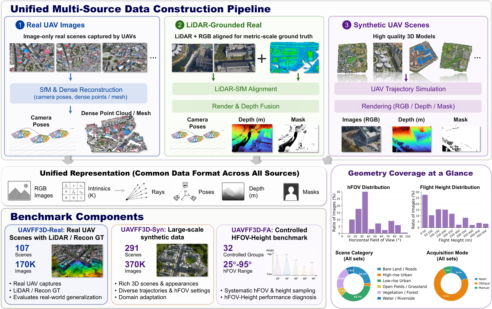

# UAVFF3D: A Geometry-Aware Benchmark for Feed-Forward UAV 3D Reconstruction

> **UAVFF3D** is a geometry-aware real-synthetic benchmark for evaluating and adapting feed-forward 3D reconstruction models under UAV photogrammetric acquisition. It focuses on camera-geometry robustness, including oblique-view degradation and horizontal field-of-view (hFOV)-height ambiguity.

[](#dataset-release)
[](https://github.com/yanxian-ll/UAVFF3D-Pipeline)
[](https://github.com/yanxian-ll/uavff3d_evaluate_forward_models)
[](LICENSE)

<p align="center">
  
</p>

<p align="center">
  <em>Overview of UAVFF3D, including real UAV scenes, synthetic UAV data, controlled geometry diagnostics, and the unified data processing pipeline.</em>
</p>

---

## Overview

Recent feed-forward 3D reconstruction models can directly predict camera parameters, depth, rays, point maps, or dense 3D geometry from images. However, UAV imagery introduces camera geometries that are underrepresented in many general-purpose reconstruction datasets, including:

- high-altitude nadir views;
- oblique and multi-camera UAV acquisition;
- large horizontal field-of-view variation;
- coupled hFOV-height changes and similar-image-footprint ambiguity;
- metric-scale, ray-direction, and camera-scene consistency challenges.

UAVFF3D addresses these challenges through three complementary goals:

1. **UAV-domain adaptation**  
   Provide real and synthetic UAV-style data for fine-tuning feed-forward reconstruction models.

2. **Metric real-world evaluation**  
   Evaluate reconstruction quality on real UAV scenes with LiDAR-supported or reconstruction-based reference geometry.

3. **Controlled camera-geometry diagnosis**  
   Analyze failure modes caused by oblique acquisition and hFOV-height ambiguity.

All dataset components are prepared through the [UAVFF3D-Pipeline](https://github.com/yanxian-ll/UAVFF3D-Pipeline), which converts raw or downloaded data into a unified scene format, generates metadata, builds covisibility graphs, and creates train/validation/test split files.

---

## Dataset Components and Release

UAVFF3D contains three complementary components.

| Component | Description | Main Use | Status |
| --- | --- | --- | --- |
| **UAVFF3D-Real** | Real UAV imagery with reconstruction supervision and LiDAR-supported real-world test scenes. | Real-world evaluation and UAV-domain adaptation. | Coming soon |
| **UAVFF3D-Syn** | Controllable synthetic UAV data rendered from textured 3D assets with diverse flight heights, hFOVs, nadir views, oblique views, and irregular trajectories. | Camera-geometry coverage and synthetic UAV-domain adaptation. | Coming soon |
| **UAVFF3D-FA** | Controlled hFOV-height diagnostic split where hFOV and flight height are changed while the image footprint remains approximately comparable. | Projection-geometry and metric-scale robustness diagnosis. | Available via [Baidu Netdisk](https://pan.baidu.com/s/1CM5J3LOOsRW9cDifWvK2Nw?pwd=nm2i), extraction code: `nm2i` |

Implementation-level synthetic subsets may be organized as:

```text
UAVFF3D-Syn-L/
UAVFF3D-Syn-S/
```

These two folders correspond to the large-scale and small/local synthetic subsets of **UAVFF3D-Syn**.

Suggested local layout after downloading or preparing data:

```text
UAVFF3D_DATA_ROOT/
  UAVFF3D-Real/
  UAVFF3D-Syn-L/
  UAVFF3D-Syn-S/
  UAVFF3D-FA/
metadata/
```

---

## Companion Repositories

UAVFF3D uses separate repositories for data preparation and downstream model fine-tuning/evaluation.

| Repository | Role |
| --- | --- |
| [UAVFF3D-Pipeline](https://github.com/yanxian-ll/UAVFF3D-Pipeline) | Converts UAVFF3D and external UAV/MVS datasets into the unified UAVFF3D/WAI scene format, generates metadata and split files, builds covisibility graphs, and supports synthetic UAV rendering/view selection. |
| [uavff3d_evaluate_forward_models](https://github.com/yanxian-ll/uavff3d_evaluate_forward_models) | Provides the downstream fine-tuning and benchmark evaluation framework, including UAVFF3D-specific data loaders, configs, scripts, model wrappers, and prior-aware evaluation settings. |

---

## Data Preparation Workflow

### 1. Install the Data Processing Pipeline

```bash
git clone https://github.com/yanxian-ll/UAVFF3D-Pipeline.git
cd UAVFF3D-Pipeline

python -m venv .venv
source .venv/bin/activate

pip install -U pip
pip install -r requirements.txt
pip install -e .
```

For GPU-accelerated rendering or PyTorch-based processing, install a PyTorch build that matches your CUDA version before running the relevant scripts.

### 2. Generate Scene Metadata

```bash
python generate_scene_meta.py \
  --root_dir ${UAVFF3D_DATA_ROOT} \
  --dataset UAVFF3D-Real UAVFF3D-Syn-L UAVFF3D-Syn-S UAVFF3D-FA \
  --overwrite
```

This generates `scene_meta.json` inside each valid scene folder.

### 3. Generate Split Files

```bash
python split_scene.py \
  --root ${UAVFF3D_DATA_ROOT} \
  --metadata ./metadata \
  --dataset UAVFF3D-Real UAVFF3D-Syn-L UAVFF3D-Syn-S UAVFF3D-FA
```

The generated split files follow this pattern:

```text
metadata/train/UAVFF3D-Real_scene_list_train.npy
metadata/train/UAVFF3D-Real_scene_list_train.txt
metadata/train/UAVFF3D-Real_scene_hfov_train.json
```

The same structure is generated for validation and test splits when applicable.

### 4. Build Covisibility Graphs

```bash
python covisibility.py \
  --config configs/covisibility_config.yaml \
  --root ${UAVFF3D_DATA_ROOT}/UAVFF3D-Syn-L
```

The covisibility graph is computed by depth reprojection. It stores strong covisible neighbors for each source view and can be used by downstream multi-view samplers.

---

## Unified Scene Format

Processed scenes follow a common data format across real UAV data, LiDAR-supported data, and synthetic scenes.

```text
scene/
  images/
    000000.png
    000001.png
    ...
  cams/
    000000.txt
    000001.txt
    ...
  depth/
    000000.exr
    000001.exr
    ...
  mask/
    000000.png
    000001.png
    ...
  scene_meta.json
```

The required modalities are:

```text
images/
cams/
depth/
```

The optional modality is:

```text
mask/
```

File stems must match across `images/`, `cams/`, and `depth/`. For example:

```text
images/000123.png
cams/000123.txt
depth/000123.exr
mask/000123.png
```

Camera files follow a BlendedMVS-style text format:

```text
extrinsic
<4 numbers>
<4 numbers>
<4 numbers>
<4 numbers>

intrinsic
<3 numbers>
<3 numbers>
<3 numbers>

h w hfov
<height> <width> <horizontal_fov_degrees>
```

The extrinsic matrix is interpreted as a world-to-camera matrix. The generated metadata stores the inverse camera-to-world transform in the OpenCV camera convention:

```text
x right, y down, z forward
```

---


## Fine-tuning and Evaluation

The fine-tuning and evaluation repository is available at [uavff3d_evaluate_forward_models](https://github.com/yanxian-ll/uavff3d_evaluate_forward_models).

```bash
git clone https://github.com/yanxian-ll/uavff3d_evaluate_forward_models.git
cd uavff3d_evaluate_forward_models

conda create -n uavff3d python=3.12 -y
conda activate uavff3d

pip install -e .
```

Before running training or evaluation, update dataset roots, checkpoint paths, and machine-specific paths in the corresponding config files.

The evaluation framework supports image-only and prior-aware model inputs.

| Setting | Input |
| --- | --- |
| **RGB** | Images only |
| **C** | Images + camera intrinsics |
| **P** | Images + camera poses |
| **CP** | Images + camera intrinsics + camera poses |

Representative feed-forward reconstruction models evaluated by the project include:

- VGGT;
- Pi3;
- MapAnything;
- Pi3X;
- Depth Anything 3.

The fine-tuning code uses a MapAnything-based training interface so that data sampling, multi-view preprocessing, and metric reporting remain consistent across models.

---

## Evaluation Protocol

UAVFF3D evaluates predicted cameras and dense geometry as a coupled reconstruction result. Instead of aligning camera poses and point clouds independently, the benchmark estimates one scene-level similarity transform and applies it consistently to both the predicted dense geometry and the predicted cameras.

| Metric | Target |
| --- | --- |
| **AbsRel Depth** | Image-aligned metric depth accuracy |
| **Ray Error** | Camera-ray and projection-geometry consistency |
| **Pose ATE** | Camera-center accuracy after shared scene-level alignment |
| **Rotation MAE** | Camera-orientation accuracy |
| **Chamfer-L1** | Dense 3D geometry accuracy |

This shared-alignment protocol is designed to expose camera-scene inconsistency that can be hidden by separate camera and geometry alignments.

---

## Compatibility Notes

The main project, data processing pipeline, and fine-tuning/evaluation repository use the following naming convention:

```text
UAVFF3D
UAVFF3D-Real
UAVFF3D-Syn
UAVFF3D-Syn-L
UAVFF3D-Syn-S
UAVFF3D-FA
uavff3d
```

Use these names consistently in configs, scripts, metadata, and documentation.

---

## Citation

If you use UAVFF3D, the data processing pipeline, or the fine-tuning/evaluation framework, please cite the paper.

```bibtex
@misc{yang2026uavff3d,
      title={UAVFF3D: A Geometry-Aware Benchmark for Feed-Forward UAV 3D Reconstruction}, 
      author={Xiang Yang and Yongli Wang and HaiFeng Li and Yunsheng Zhang},
      year={2026},
      eprint={2605.17942},
      archivePrefix={arXiv},
      primaryClass={cs.CV},
      url={https://arxiv.org/abs/2605.17942}, 
}
```

---

## License

The documentation and project-page files in this repository are released under the Apache License 2.0. See [LICENSE](LICENSE).

The dataset, 3D assets, pretrained checkpoints, fine-tuned checkpoints, and third-party model code may be released under different licenses. Please check the dataset release notes and the `THIRD_PARTY.md` / `NOTICE` files in the companion repositories before redistribution or commercial use.

---

## Acknowledgements

UAVFF3D builds on prior work in photogrammetric reconstruction, UAV mapping, synthetic data generation, and feed-forward 3D reconstruction. The fine-tuning/evaluation repository is based on the MapAnything framework and integrates several third-party feed-forward reconstruction models for benchmark comparison.
